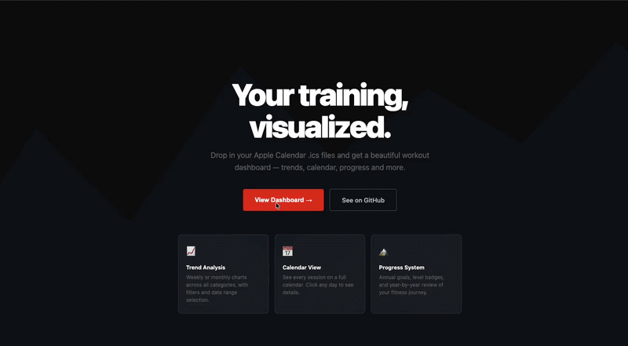
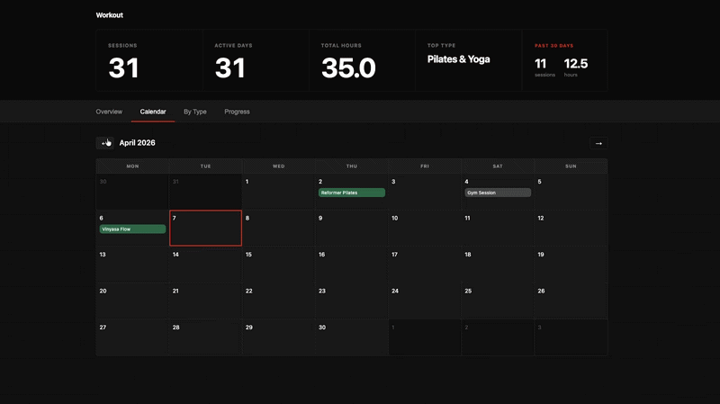
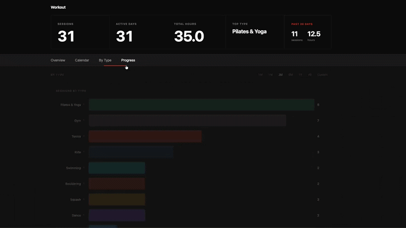

# Workout Dashboard


### [▶ View Live Demo →](https://wenqingchen-makes.github.io/workout-dashboard/dashboard.html)

> Drop in your `.ics` files → run one command → get a beautiful workout dashboard.  
> No accounts, no cloud, no tracking.



Turn your calendar workout data into beautiful insights. Works with Apple Calendar, Google Calendar, Outlook, or any app that exports `.ics` files.

---

## Why I built this

Most fitness apps want you to log workouts inside their ecosystem. But if you already track sessions in your calendar, you shouldn't need to change your workflow just to get insights.

This dashboard reads your existing `.ics` files and visualises your training patterns — no accounts, no cloud uploads, your data never leaves your device.

---

## Features

- 📅 **Calendar view** — See every session laid out like a real calendar, click any day for details



- 📈 **Trend analysis** — Weekly and monthly charts with type filtering and custom date ranges
- 🎯 **Fully customisable** — Define your own workout categories via `config.json`
- 🏔️ **Progress system** — Annual goals, level progression, and achievement badges



- 🔒 **100% local** — Your data never leaves your machine

---

## Quick Start

### 1. Export your calendar data

Export `.ics` files from your calendar app:
- **Apple Calendar:** File → Export → Export...
- **Google Calendar:** Settings → Import & Export → Export
- **Outlook:** File → Open & Export → Import/Export

### 2. Set up your files
```bash
git clone https://github.com/wenqingchen-makes/workout-dashboard
cd workout-dashboard
```

Drop your `.ics` files into the `data/` folder.

### 3. Customise your categories

**This is the most important step.** Everyone's calendar event names are different.

Open `config.json` and update the keywords to match how your workouts are named in your calendar:
```json
{
  "annual_target": 250,
  "categories": {
    "Your Category Name": {
      "keywords": ["keyword from your calendar events"],
      "color": "#2D6A4F"
    }
  }
}
```

> **Example:** If your yoga classes appear as "Flow Studio — Vinyasa" in your calendar, add `"flow studio"` and `"vinyasa"` as keywords under your Yoga category.

### 4. Generate your dashboard
```bash
python3 generate_dashboard.py
open dashboard.html
```

---

## Updating your data

**This tool requires manual updates.** It reads a snapshot of your calendar at export time and does not sync automatically.

**Recommended workflow:**
1. At the start of each month, export fresh `.ics` files from your calendar app
2. Replace the files in the `data/` folder
3. Run `python3 generate_dashboard.py`
4. Refresh your browser

The whole process takes about 2–3 minutes. Setting a monthly reminder helps build the habit.

---

## Customisation

All configuration lives in `config.json`:

| Field | Description |
|-------|-------------|
| `annual_target` | Your yearly session goal (used in Progress tab) |
| `categories` | Define workout types with keywords and colours |
| `dashboard_title` | Change the dashboard name |
| `github_url` | Your repository link (shown in landing page) |

**Adding a new category:**
```json
"Swimming": {
  "keywords": ["swim", "pool", "aqua"],
  "color": "#0A7E8C"
}
```

> **Common issue:** Seeing 0 sessions for a category? Check that your keywords match your actual calendar event names exactly (case-insensitive).

---

## Adapting for your data

Your calendar event names will be different from the sample data included. Here's how to adapt:

1. Open your calendar app and note exactly how your workout events are named
2. Open `config.json` and update the keywords to match
3. Run the script and check the terminal output — it will show you how many events were matched per category
4. If events are missing, add more keywords to catch them

---

## Tech stack

- **Python** — `.ics` parsing and data processing (standard library only, no pip install)
- **Chart.js** — Data visualisations
- **Vanilla HTML / CSS / JS** — No frameworks, no build tools
- **Single file output** — Everything compiles into one `dashboard.html`

---

## Built with Claude

This project was built through iterative collaboration with [Claude](https://claude.ai) — designing the data model, refining the UI, and debugging edge cases together.

---

## License

MIT © [Wenqing Chen](https://github.com/wenqingchen-makes)

Free to use and modify — if you build something with this, a credit or a star ⭐ is always appreciated.
